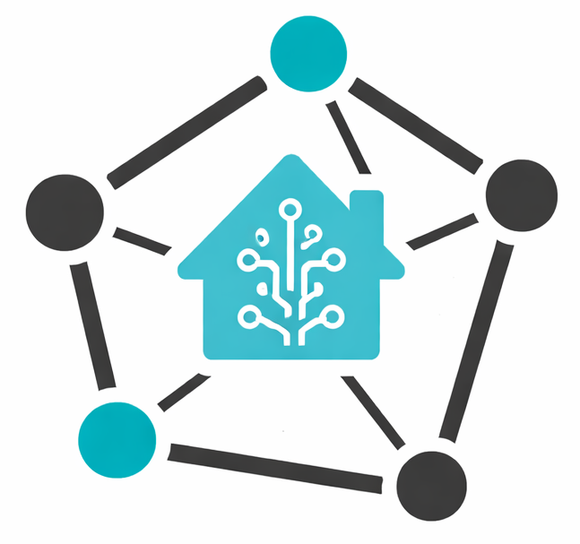

#  Zigbee ZHA Mesh Graph Export


Export ZHA devices and neighbor edges from Home Assistant to CSV files.

## Requirements
- Python 3.10+ (or your system Python that Home Assistant supports)
- `uv` for creating the virtual environment

## Setup (uv only)
1) Install `uv` (pick one):

```bash
# macOS
brew install uv

# Linux (official installer)
curl -LsSf https://astral.sh/uv/install.sh | sh
```

2) Create and activate a virtual environment with `uv`:

```bash
uv venv .venv
source .venv/bin/activate
```

3) Install dependencies:

```bash
uv pip install websockets
```

## Configure
1) Create `token.txt` with your Home Assistant long-lived access token:

```txt
<PASTE_YOUR_LONG_LIVED_TOKEN>
```

2) Confirm the HA URL in `export_zha_mesh.py` matches your instance.

## Run
```bash
python export_zha_mesh.py
```

Outputs:
- `nodes.csv`
- `edges.csv`

## How it works
- The script connects to Home Assistant’s WebSocket API at `/api/websocket`.
- It calls `zha/devices` and builds:
  - `nodes.csv` from the device list.
  - `edges.csv` from each device’s `neighbors` list (included in `zha/devices` on HA 2026.1.x).
- If you need to confirm what the API returns, run:

```bash
python ha_ws_probe.py
```

This writes `ws_probe_results.json` with raw responses for debugging.

## Export a graph
You can turn the CSVs into a graph in a few ways:

### Gephi (quick visual)
1) Open Gephi → New Project.
2) Import `nodes.csv` as **Nodes table**.
3) Import `edges.csv` as **Edges table** (directed).
4) Run a layout (e.g., ForceAtlas 2) and style by device type.

### Python (NetworkX + PyVis)
```bash
uv pip install networkx pyvis pandas
```

```python
import pandas as pd
import networkx as nx
from pyvis.network import Network

nodes = pd.read_csv("nodes.csv")
edges = pd.read_csv("edges.csv")

G = nx.from_pandas_edgelist(edges, "source", "target", create_using=nx.DiGraph())
for _, r in nodes.iterrows():
    if r["id"] in G:
        G.nodes[r["id"]]["label"] = r.get("label", r["id"])
        G.nodes[r["id"]]["device_type"] = r.get("device_type", "")

net = Network(height="800px", width="100%", directed=True)
net.from_nx(G)
net.show("zha_mesh.html")
```

Open `zha_mesh.html` in a browser.

## Notes
- If your HA version doesn’t include `neighbors` in `zha/devices`, `edges.csv` may be empty.

## License
MIT. See `LICENSE`.
